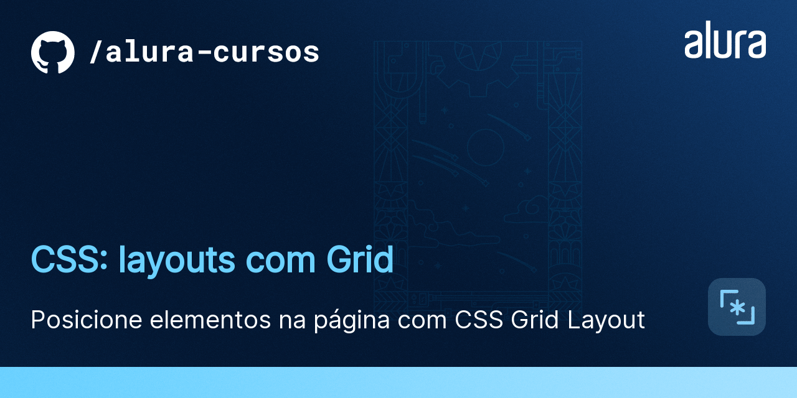

  

<h1>AluraCast</h1>
## Projeto (em desenvolvimento :clock1:)

Colocando em prática o aprendizado em Grids, com um projeto de uma estática inspirada em uma plataforma de streamming de músicas e podcasts. Realizado durante o curso <strong><em>"CSS: layouts com Grid"</strong></em> da escola Alura.

## 🛠️ Recursos
* HTML
* CSS

## 1400px

## 1024px

## 360px

