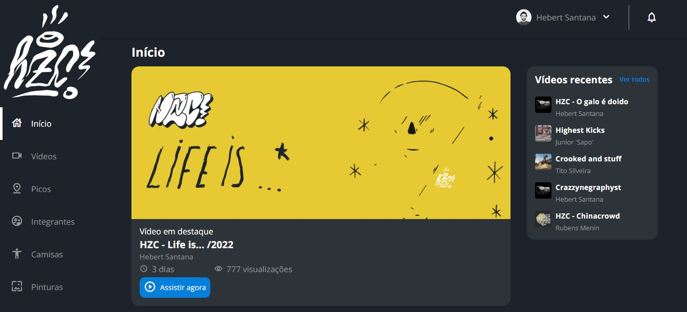

# Alura-HZC

### Repositório criado durante o curso de CSS: dispondo elementos com Flexbox e Grid da escola [Alura](https://www.alura.com.br/).
 

   

 

 O projeto desenvolvido como base em um layout disponibilizado no Figma. A estrutura foi construída a partir da modalidade mobile first, utilizando as propriedades de flexbox e grid. Também foi utilizado as medias queries para trabalhar na responsividade da página. 

## 🛠️ Recursos

* HTML
* CSS
* JavaScript

### Autor
[ Hebert Santana](https://github.com/hebert-santana)
 

